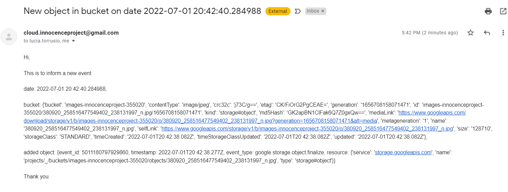

# Cloud-Terraform
Archivos Terraform (Infrastracture as Code) que permiten desplegar algunos de los recursos de la arquitectura planteada en el TP2.

## Cambios en la arquitectura
* Al implementar el Load Balancer, notamos que API Gateway no es una opción para el endpoint aún. Dada esta restricción, creamos Network Endpoint Groups donde se ubicarían instancias de Cloud Run con los distintos servicios, y hacia ellos redirige el nuevo Load Balancer.

* Añadimos una Cloud Function sobre un bucket de Cloud Storage que se triggerea al subir un archivo, y manda un email notificando este hecho.

    

## Terraform Functions
- [format](https://www.terraform.io/language/functions/format)
- [map](https://www.terraform.io/language/functions/map)
- [timestamp](https://www.terraform.io/language/functions/timestamp)
- [formatdate](https://www.terraform.io/language/functions/formatdate)
- [can](https://www.terraform.io/language/functions/can1)
- [toset](https://www.terraform.io/language/functions/toset)

## Terraform Meta-Arguments
- [depends_on](https://www.terraform.io/language/meta-arguments/depends_on)
- [for_each](https://www.terraform.io/language/meta-arguments/for_each)
- [lifecycle](https://www.terraform.io/language/meta-arguments/lifecycle)

## Pasos

`$> cd terraform-gcp`

`$> gcloud auth login`

`$> terraform init`

`$> terraform validate`

`$> terraform plan`

`$> terraform apply`